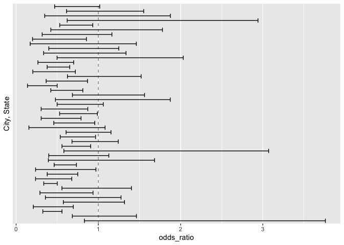

Homework 6
================

# Problem 1

# Problem 2

``` r
urlfile="https://raw.githubusercontent.com/washingtonpost/data-homicides/master/homicide-data.csv"
post_homicide = read_csv(url(urlfile))
```

    ## Rows: 52179 Columns: 12
    ## ── Column specification ────────────────────────────────────────────────────────
    ## Delimiter: ","
    ## chr (9): uid, victim_last, victim_first, victim_race, victim_age, victim_sex...
    ## dbl (3): reported_date, lat, lon
    ## 
    ## ℹ Use `spec()` to retrieve the full column specification for this data.
    ## ℹ Specify the column types or set `show_col_types = FALSE` to quiet this message.

``` r
set.seed(1)
post_homicide =
  post_homicide %>% 
  mutate(city_state = paste(city, state, sep=", ")) %>% 
  filter(!city_state %in% c("Dallas, TX", "Phoenix, AZ", "Kansas City, MO", "Tulsa, AL")) %>% 
  filter(victim_race %in% c("Black", "White")) %>% 
  mutate(
    homicide_solved = as.numeric(disposition == "Closed by arrest"),
    victim_race = fct_relevel(victim_race, "White"),
    victim_age = as.numeric(victim_age),
    victim_sex = fct_relevel(victim_sex, "Female")
  ) %>% 
  select(city_state, homicide_solved, victim_age, victim_sex, victim_race)
```

    ## Warning in mask$eval_all_mutate(quo): NAs introduced by coercion

### Odds Ratio and Confidence Interval for Baltimore, MD

``` r
baltimore_reg =
  post_homicide %>% 
  filter(city_state == "Baltimore, MD") %>% 
  glm(homicide_solved ~ victim_age + victim_sex + victim_race, data = ., family = binomial()) %>%
  tidy() %>% 
  filter(term == "victim_sexMale") %>% 
  select(term, estimate, std.error) %>% 
  mutate(
    odds_ratio = exp(estimate),
    low_conf = exp(estimate - 1.96*std.error),
    upper_conf = exp(estimate + 1.96*std.error)) %>% 
  select(-estimate, -std.error)
 
baltimore_reg %>% 
  knitr::kable(digits = 3)
```

| term           | odds_ratio | low_conf | upper_conf |
|:---------------|-----------:|---------:|-----------:|
| victim_sexMale |      0.426 |    0.325 |      0.558 |

Homicides in which the victim is male are significantly less like to be
resolved than those in which the victim is female. The odds of having a
resolved

### Odds Ratio and Confidence Interval for All Cities

``` r
cities_reg = 
  post_homicide %>%
  nest(data = -city_state) %>% 
  mutate(model = map(data, ~glm(homicide_solved ~ victim_age + victim_sex + victim_race, data = ., family = binomial())),
         results = map(model, broom::tidy)) %>% 
  select(-data, -model) %>% 
  unnest(results) %>% 
  filter(term == "victim_sexMale") %>% 
  select(city_state, term, estimate, std.error) %>% 
  mutate(
    odds_ratio = exp(estimate),
    low_conf = exp(estimate - 1.96*std.error),
    upper_conf = exp(estimate + 1.96*std.error)) %>% 
  select(-estimate, -std.error)

cities_reg %>% 
  knitr::kable(digits = 3)
```

| city_state         | term           | odds_ratio | low_conf | upper_conf |
|:-------------------|:---------------|-----------:|---------:|-----------:|
| Albuquerque, NM    | victim_sexMale |      1.767 |    0.831 |      3.761 |
| Atlanta, GA        | victim_sexMale |      1.000 |    0.684 |      1.463 |
| Baltimore, MD      | victim_sexMale |      0.426 |    0.325 |      0.558 |
| Baton Rouge, LA    | victim_sexMale |      0.381 |    0.209 |      0.695 |
| Birmingham, AL     | victim_sexMale |      0.870 |    0.574 |      1.318 |
| Boston, MA         | victim_sexMale |      0.674 |    0.356 |      1.276 |
| Buffalo, NY        | victim_sexMale |      0.521 |    0.290 |      0.935 |
| Charlotte, NC      | victim_sexMale |      0.884 |    0.557 |      1.403 |
| Chicago, IL        | victim_sexMale |      0.410 |    0.336 |      0.501 |
| Cincinnati, OH     | victim_sexMale |      0.400 |    0.236 |      0.677 |
| Columbus, OH       | victim_sexMale |      0.532 |    0.378 |      0.750 |
| Denver, CO         | victim_sexMale |      0.479 |    0.236 |      0.971 |
| Detroit, MI        | victim_sexMale |      0.582 |    0.462 |      0.734 |
| Durham, NC         | victim_sexMale |      0.812 |    0.392 |      1.683 |
| Fort Worth, TX     | victim_sexMale |      0.669 |    0.397 |      1.127 |
| Fresno, CA         | victim_sexMale |      1.335 |    0.580 |      3.071 |
| Houston, TX        | victim_sexMale |      0.711 |    0.558 |      0.907 |
| Indianapolis, IN   | victim_sexMale |      0.919 |    0.679 |      1.242 |
| Jacksonville, FL   | victim_sexMale |      0.720 |    0.537 |      0.966 |
| Las Vegas, NV      | victim_sexMale |      0.837 |    0.608 |      1.154 |
| Long Beach, CA     | victim_sexMale |      0.410 |    0.156 |      1.082 |
| Los Angeles, CA    | victim_sexMale |      0.662 |    0.458 |      0.956 |
| Louisville, KY     | victim_sexMale |      0.491 |    0.305 |      0.790 |
| Memphis, TN        | victim_sexMale |      0.723 |    0.529 |      0.988 |
| Miami, FL          | victim_sexMale |      0.515 |    0.304 |      0.872 |
| Milwaukee, wI      | victim_sexMale |      0.727 |    0.499 |      1.060 |
| Minneapolis, MN    | victim_sexMale |      0.947 |    0.478 |      1.875 |
| Nashville, TN      | victim_sexMale |      1.034 |    0.685 |      1.562 |
| New Orleans, LA    | victim_sexMale |      0.585 |    0.422 |      0.811 |
| New York, NY       | victim_sexMale |      0.262 |    0.138 |      0.499 |
| Oakland, CA        | victim_sexMale |      0.563 |    0.365 |      0.868 |
| Oklahoma City, OK  | victim_sexMale |      0.974 |    0.624 |      1.520 |
| Omaha, NE          | victim_sexMale |      0.382 |    0.203 |      0.721 |
| Philadelphia, PA   | victim_sexMale |      0.496 |    0.378 |      0.652 |
| Pittsburgh, PA     | victim_sexMale |      0.431 |    0.265 |      0.700 |
| Richmond, VA       | victim_sexMale |      1.006 |    0.498 |      2.033 |
| San Antonio, TX    | victim_sexMale |      0.705 |    0.398 |      1.249 |
| Sacramento, CA     | victim_sexMale |      0.669 |    0.335 |      1.337 |
| Savannah, GA       | victim_sexMale |      0.867 |    0.422 |      1.780 |
| San Bernardino, CA | victim_sexMale |      0.500 |    0.171 |      1.462 |
| San Diego, CA      | victim_sexMale |      0.413 |    0.200 |      0.855 |
| San Francisco, CA  | victim_sexMale |      0.608 |    0.317 |      1.165 |
| St. Louis, MO      | victim_sexMale |      0.703 |    0.530 |      0.932 |
| Stockton, CA       | victim_sexMale |      1.352 |    0.621 |      2.942 |
| Tampa, FL          | victim_sexMale |      0.808 |    0.348 |      1.876 |
| Tulsa, OK          | victim_sexMale |      0.976 |    0.614 |      1.552 |
| Washington, DC     | victim_sexMale |      0.690 |    0.468 |      1.017 |

#### Plot

``` r
cities_reg %>% 
  ggplot(aes(x = odds_ratio, y = city_state, xmin = low_conf, xmax = upper_conf)) +
  geom_errorbar(height = .1) +
  scale_y_discrete(name = "City, State", breaks=1:nrow(cities_reg), labels=cities_reg$city_state) + geom_vline(xintercept=1, color='black', linetype='dashed', alpha=.5)
```

    ## Warning: Ignoring unknown parameters: height

<!-- -->

``` r
  labs(
    x = "Odds Ratio",
    y = "City, State"
  )
```

    ## $x
    ## [1] "Odds Ratio"
    ## 
    ## $y
    ## [1] "City, State"
    ## 
    ## attr(,"class")
    ## [1] "labels"
