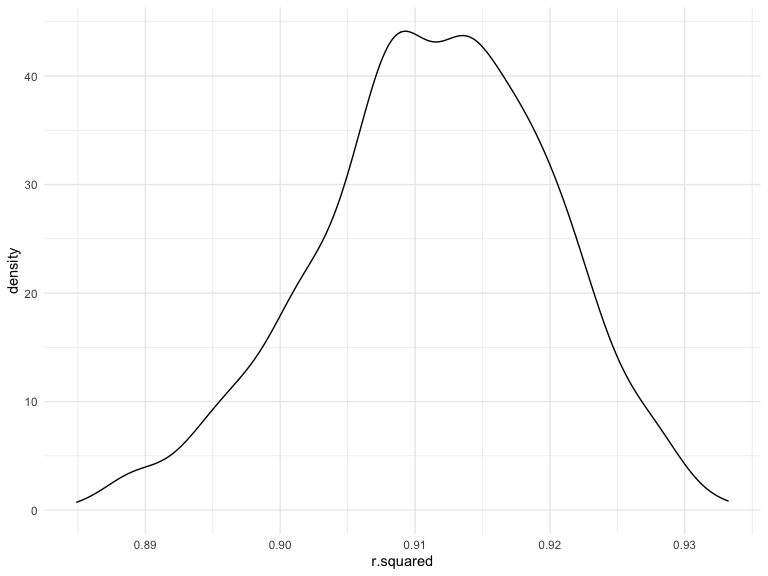
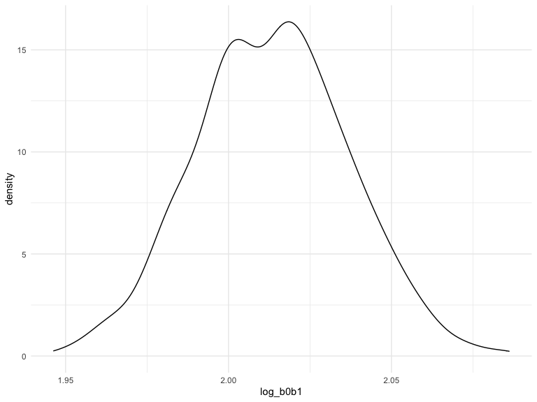
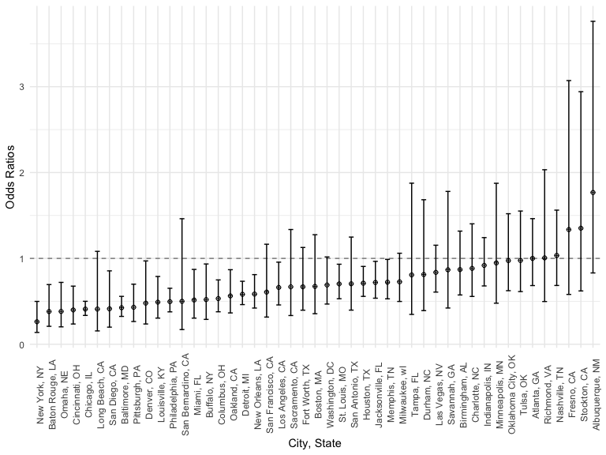
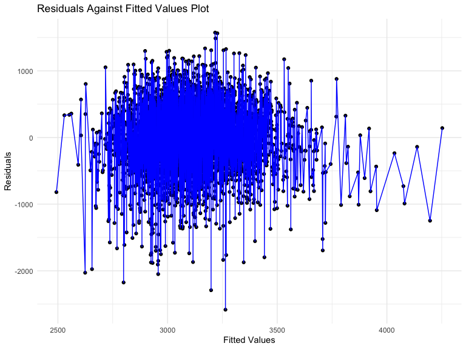
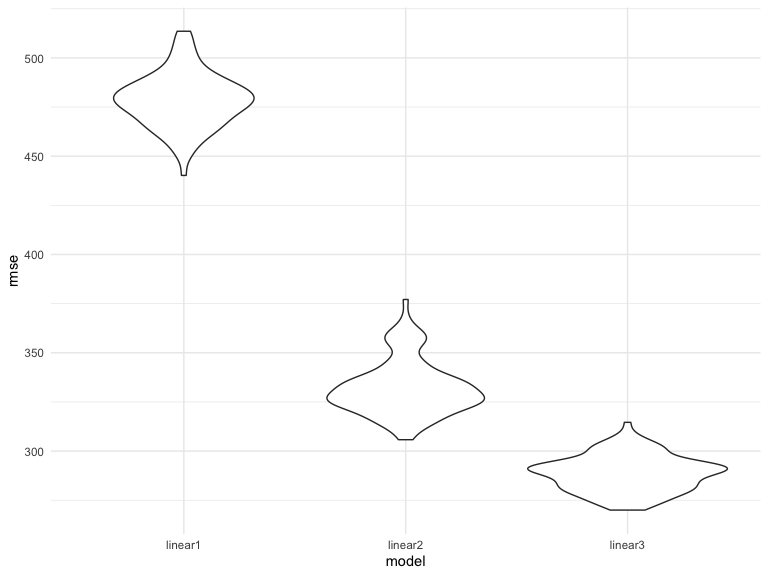

Homework 6
================

# Problem 1

To obtain a distribution for $\hat{r}^2$, we’ll follow basically the
same procedure we used for regression coefficients: draw bootstrap
samples; the a model to each; extract the value I’m concerned with; and
summarize. Here, we’ll use `modelr::bootstrap` to draw the samples and
`broom::glance` to produce `r.squared` values.

``` r
weather_df = 
  rnoaa::meteo_pull_monitors(
    c("USW00094728"),
    var = c("PRCP", "TMIN", "TMAX"), 
    date_min = "2017-01-01",
    date_max = "2017-12-31") %>%
  mutate(
    name = recode(id, USW00094728 = "CentralPark_NY"),
    tmin = tmin / 10,
    tmax = tmax / 10) %>%
  select(name, id, everything())
```

    ## Registered S3 method overwritten by 'hoardr':
    ##   method           from
    ##   print.cache_info httr

    ## using cached file: ~/Library/Caches/R/noaa_ghcnd/USW00094728.dly

    ## date created (size, mb): 2022-09-29 10:30:38 (8.401)

    ## file min/max dates: 1869-01-01 / 2022-09-30

``` r
weather_df %>% 
  modelr::bootstrap(n = 1000) %>% 
  mutate(
    models = map(strap, ~lm(tmax ~ tmin, data = .x) ),
    results = map(models, broom::glance)) %>% 
  select(-strap, -models) %>% 
  unnest(results) %>% 
  ggplot(aes(x = r.squared)) + geom_density()
```



In this example, the $\hat{r}^2$ value is high, and the upper bound at 1
may be a cause for the generally skewed shape of the distribution. If we
wanted to construct a confidence interval for $R^2$, we could take the
2.5% and 97.5% quantiles of the estimates across bootstrap samples.
However, because the shape isn’t symmetric, using the mean +/- 1.96
times the standard error probably wouldn’t work well.

We can produce a distribution for $\log(\beta_0 * \beta1)$ using a
similar approach, with a bit more wrangling before we make our plot.

``` r
weather_df %>% 
  modelr::bootstrap(n = 1000) %>% 
  mutate(
    models = map(strap, ~lm(tmax ~ tmin, data = .x) ),
    results = map(models, broom::tidy)) %>% 
  select(-strap, -models) %>% 
  unnest(results) %>% 
  select(id = `.id`, term, estimate) %>% 
  pivot_wider(
    names_from = term, 
    values_from = estimate) %>% 
  rename(beta0 = `(Intercept)`, beta1 = tmin) %>% 
  mutate(log_b0b1 = log(beta0 * beta1)) %>% 
  ggplot(aes(x = log_b0b1)) + geom_density()
```



As with $r^2$, this distribution is somewhat skewed and has some
outliers.

The point of this is not to say you should always use the bootstrap –
it’s possible to establish “large sample” distributions for strange
parameters / values / summaries in a lot of cases, and those are great
to have. But it is helpful to know that there’s a way to do inference
even in tough cases.

# Problem 2

``` r
urlfile="https://raw.githubusercontent.com/washingtonpost/data-homicides/master/homicide-data.csv"
post_homicide = read_csv(url(urlfile))
```

    ## Rows: 52179 Columns: 12
    ## ── Column specification ────────────────────────────────────────────────────────
    ## Delimiter: ","
    ## chr (9): uid, victim_last, victim_first, victim_race, victim_age, victim_sex...
    ## dbl (3): reported_date, lat, lon
    ## 
    ## ℹ Use `spec()` to retrieve the full column specification for this data.
    ## ℹ Specify the column types or set `show_col_types = FALSE` to quiet this message.

``` r
set.seed(1)
post_homicide =
  post_homicide %>% 
  mutate(city_state = paste(city, state, sep=", ")) %>% 
  filter(!city_state %in% c("Dallas, TX", "Phoenix, AZ", "Kansas City, MO", "Tulsa, AL")) %>% 
  filter(victim_race %in% c("Black", "White")) %>% 
  mutate(
    homicide_solved = as.numeric(disposition == "Closed by arrest"),
    victim_race = fct_relevel(victim_race, "White"),
    victim_age = as.numeric(victim_age),
    victim_sex = fct_relevel(victim_sex, "Female")
  ) %>% 
  select(city_state, homicide_solved, victim_age, victim_sex, victim_race)

post_homicide
```

    ## # A tibble: 39,693 × 5
    ##    city_state      homicide_solved victim_age victim_sex victim_race
    ##    <chr>                     <dbl>      <dbl> <fct>      <fct>      
    ##  1 Albuquerque, NM               0         15 Female     White      
    ##  2 Albuquerque, NM               0         72 Female     White      
    ##  3 Albuquerque, NM               0         91 Female     White      
    ##  4 Albuquerque, NM               0         56 Male       White      
    ##  5 Albuquerque, NM               0         NA Male       White      
    ##  6 Albuquerque, NM               1         43 Female     White      
    ##  7 Albuquerque, NM               1         52 Male       White      
    ##  8 Albuquerque, NM               1         22 Female     White      
    ##  9 Albuquerque, NM               1         15 Male       Black      
    ## 10 Albuquerque, NM               1         25 Male       Black      
    ## # … with 39,683 more rows

### Odds Ratio and Confidence Interval for Baltimore, MD

``` r
baltimore_reg =
  post_homicide %>% 
  filter(city_state == "Baltimore, MD") %>% 
  glm(homicide_solved ~ victim_age + victim_sex + victim_race, data = ., family = binomial()) %>%
  tidy() %>% 
  filter(term == "victim_sexMale") %>% 
  select(term, estimate, std.error) %>% 
  mutate(
    odds_ratio = exp(estimate),
    low_conf = exp(estimate - 1.96*std.error),
    upper_conf = exp(estimate + 1.96*std.error)) %>% 
  select(-estimate, -std.error)
 
baltimore_reg %>% 
  knitr::kable(digits = 3)
```

| term           | odds_ratio | low_conf | upper_conf |
|:---------------|-----------:|---------:|-----------:|
| victim_sexMale |      0.426 |    0.325 |      0.558 |

Homicides in which the victim is male are significantly less like to be
resolved than those in which the victim is female.

### Odds Ratio and Confidence Interval for All Cities

``` r
cities_reg = 
  post_homicide %>%
  nest(data = -city_state) %>% 
  mutate(model = map(data, ~glm(homicide_solved ~ victim_age + victim_sex + victim_race, data = ., family = binomial())),
         results = map(model, broom::tidy)) %>% 
  select(-data, -model) %>% 
  unnest(results) %>% 
  filter(term == "victim_sexMale") %>% 
  select(city_state, term, estimate, std.error) %>% 
  mutate(
    odds_ratio = exp(estimate),
    low_conf = exp(estimate - 1.96*std.error),
    upper_conf = exp(estimate + 1.96*std.error)) %>% 
  select(-estimate, -std.error)

cities_reg %>% 
  knitr::kable(digits = 3)
```

| city_state         | term           | odds_ratio | low_conf | upper_conf |
|:-------------------|:---------------|-----------:|---------:|-----------:|
| Albuquerque, NM    | victim_sexMale |      1.767 |    0.831 |      3.761 |
| Atlanta, GA        | victim_sexMale |      1.000 |    0.684 |      1.463 |
| Baltimore, MD      | victim_sexMale |      0.426 |    0.325 |      0.558 |
| Baton Rouge, LA    | victim_sexMale |      0.381 |    0.209 |      0.695 |
| Birmingham, AL     | victim_sexMale |      0.870 |    0.574 |      1.318 |
| Boston, MA         | victim_sexMale |      0.674 |    0.356 |      1.276 |
| Buffalo, NY        | victim_sexMale |      0.521 |    0.290 |      0.935 |
| Charlotte, NC      | victim_sexMale |      0.884 |    0.557 |      1.403 |
| Chicago, IL        | victim_sexMale |      0.410 |    0.336 |      0.501 |
| Cincinnati, OH     | victim_sexMale |      0.400 |    0.236 |      0.677 |
| Columbus, OH       | victim_sexMale |      0.532 |    0.378 |      0.750 |
| Denver, CO         | victim_sexMale |      0.479 |    0.236 |      0.971 |
| Detroit, MI        | victim_sexMale |      0.582 |    0.462 |      0.734 |
| Durham, NC         | victim_sexMale |      0.812 |    0.392 |      1.683 |
| Fort Worth, TX     | victim_sexMale |      0.669 |    0.397 |      1.127 |
| Fresno, CA         | victim_sexMale |      1.335 |    0.580 |      3.071 |
| Houston, TX        | victim_sexMale |      0.711 |    0.558 |      0.907 |
| Indianapolis, IN   | victim_sexMale |      0.919 |    0.679 |      1.242 |
| Jacksonville, FL   | victim_sexMale |      0.720 |    0.537 |      0.966 |
| Las Vegas, NV      | victim_sexMale |      0.837 |    0.608 |      1.154 |
| Long Beach, CA     | victim_sexMale |      0.410 |    0.156 |      1.082 |
| Los Angeles, CA    | victim_sexMale |      0.662 |    0.458 |      0.956 |
| Louisville, KY     | victim_sexMale |      0.491 |    0.305 |      0.790 |
| Memphis, TN        | victim_sexMale |      0.723 |    0.529 |      0.988 |
| Miami, FL          | victim_sexMale |      0.515 |    0.304 |      0.872 |
| Milwaukee, wI      | victim_sexMale |      0.727 |    0.499 |      1.060 |
| Minneapolis, MN    | victim_sexMale |      0.947 |    0.478 |      1.875 |
| Nashville, TN      | victim_sexMale |      1.034 |    0.685 |      1.562 |
| New Orleans, LA    | victim_sexMale |      0.585 |    0.422 |      0.811 |
| New York, NY       | victim_sexMale |      0.262 |    0.138 |      0.499 |
| Oakland, CA        | victim_sexMale |      0.563 |    0.365 |      0.868 |
| Oklahoma City, OK  | victim_sexMale |      0.974 |    0.624 |      1.520 |
| Omaha, NE          | victim_sexMale |      0.382 |    0.203 |      0.721 |
| Philadelphia, PA   | victim_sexMale |      0.496 |    0.378 |      0.652 |
| Pittsburgh, PA     | victim_sexMale |      0.431 |    0.265 |      0.700 |
| Richmond, VA       | victim_sexMale |      1.006 |    0.498 |      2.033 |
| San Antonio, TX    | victim_sexMale |      0.705 |    0.398 |      1.249 |
| Sacramento, CA     | victim_sexMale |      0.669 |    0.335 |      1.337 |
| Savannah, GA       | victim_sexMale |      0.867 |    0.422 |      1.780 |
| San Bernardino, CA | victim_sexMale |      0.500 |    0.171 |      1.462 |
| San Diego, CA      | victim_sexMale |      0.413 |    0.200 |      0.855 |
| San Francisco, CA  | victim_sexMale |      0.608 |    0.317 |      1.165 |
| St. Louis, MO      | victim_sexMale |      0.703 |    0.530 |      0.932 |
| Stockton, CA       | victim_sexMale |      1.352 |    0.621 |      2.942 |
| Tampa, FL          | victim_sexMale |      0.808 |    0.348 |      1.876 |
| Tulsa, OK          | victim_sexMale |      0.976 |    0.614 |      1.552 |
| Washington, DC     | victim_sexMale |      0.690 |    0.468 |      1.017 |

#### Plot

``` r
cities_reg %>% 
  mutate(city_state = fct_reorder(city_state, odds_ratio)) %>% 
  ggplot(aes(x=city_state, y = odds_ratio)) +
  geom_point(stat = "identity", shape = 10) +
  geom_errorbar(aes(ymin = low_conf, ymax = upper_conf), width = 0.4) +
  theme(legend.position = "none", axis.text.x = element_text(angle = 90)) +
  geom_hline(yintercept=1, color='black', linetype='dashed', alpha=.5)+
  labs(
    x = "City, State",
    y = "Odds Ratios"
    )
```


According to the plot, in most cities with significant odds ratios,
homicides in which the victim is male are significantly less like to be
resolved than those in which the victim is female. The cities in which
the homicides in which the victim is male are significantly more likely
to be resolved have a very wide confidence interval and include the null
value (OR = 1). Therefore, the victim’s sex may not have a significant
difference on whether or not the homicide will be resolved.

# Problem 3

``` r
child_bwt = read_csv("data/birthweight.csv")
```

    ## Rows: 4342 Columns: 20
    ## ── Column specification ────────────────────────────────────────────────────────
    ## Delimiter: ","
    ## dbl (20): babysex, bhead, blength, bwt, delwt, fincome, frace, gaweeks, malf...
    ## 
    ## ℹ Use `spec()` to retrieve the full column specification for this data.
    ## ℹ Specify the column types or set `show_col_types = FALSE` to quiet this message.

``` r
child_bwt %>% 
  mutate(
    babysex = as.factor(babysex),
    frace = as.factor(frace),
    malform = as.factor(malform),
    mrace = as.factor(mrace)
  ) 
```

    ## # A tibble: 4,342 × 20
    ##    babysex bhead blength   bwt delwt fincome frace gaweeks malform menarche
    ##    <fct>   <dbl>   <dbl> <dbl> <dbl>   <dbl> <fct>   <dbl> <fct>      <dbl>
    ##  1 2          34      51  3629   177      35 1        39.9 0             13
    ##  2 1          34      48  3062   156      65 2        25.9 0             14
    ##  3 2          36      50  3345   148      85 1        39.9 0             12
    ##  4 1          34      52  3062   157      55 1        40   0             14
    ##  5 2          34      52  3374   156       5 1        41.6 0             13
    ##  6 1          33      52  3374   129      55 1        40.7 0             12
    ##  7 2          33      46  2523   126      96 2        40.3 0             14
    ##  8 2          33      49  2778   140       5 1        37.4 0             12
    ##  9 1          36      52  3515   146      85 1        40.3 0             11
    ## 10 1          33      50  3459   169      75 2        40.7 0             12
    ## # … with 4,332 more rows, and 10 more variables: mheight <dbl>, momage <dbl>,
    ## #   mrace <fct>, parity <dbl>, pnumlbw <dbl>, pnumsga <dbl>, ppbmi <dbl>,
    ## #   ppwt <dbl>, smoken <dbl>, wtgain <dbl>

## Proposed Model

The model I propose is a linear regression model with `bwt`, baby’s
birthweight (continuous, lbs), as the outcome and `wtgain`, mother’s
weight gain during pregnancy (continuous, lbs), as the main exposure. I
hypothesize that a mother’s weight at delivery as a positive association
with baby’s birthweight, meaning that a higher mother’s weight at
delivery is associated with a higher baby’s birthweight. If the
expecting mother gains a large amount of weight, there is a higher
chance that the baby will be born weighing more than a baby born from a
mother who does not gain much weight during her pregnancy. I hypothesize
that `momage`, mother’s age at delivery (continuous, years), `delwt`,
mother’s weight at delivery (continuous, lbs), and `fincome`, family
monthly income (continuous, in hundreds, rounded) affect the association
between baby’s birthweight and mother’s weight gain during pregnancy.
Mother’s age at delivery affects the association because the older a
mother is at birth, the more at-risk she is. Therefore, there are many
more factors that may contribute to her ability or need to gain weight
during a pregnancy. A mother’s weight at delivery affects the
association because, although the mother might have gained a large
amount of weight during her pregnancy, her weight at birth may not be
that high. Family monthly income affects the association because a
family’s ability to afford groceries and other products that contribute
to weight gain may affect the amount of weight a mother may gain during
a pregnancy.

## Linear Regression Model Assessing the Association Between `bwt` (baby’s birthweight, lbs) and `wtgain` (mother’s weight gain during pregnancy, lbs)

``` r
child_bwt %>% 
  mutate(
    bwt = bwt*0.0022046226
  )
```

    ## # A tibble: 4,342 × 20
    ##    babysex bhead blength   bwt delwt fincome frace gaweeks malform menarche
    ##      <dbl> <dbl>   <dbl> <dbl> <dbl>   <dbl> <dbl>   <dbl>   <dbl>    <dbl>
    ##  1       2    34      51  8.00   177      35     1    39.9       0       13
    ##  2       1    34      48  6.75   156      65     2    25.9       0       14
    ##  3       2    36      50  7.37   148      85     1    39.9       0       12
    ##  4       1    34      52  6.75   157      55     1    40         0       14
    ##  5       2    34      52  7.44   156       5     1    41.6       0       13
    ##  6       1    33      52  7.44   129      55     1    40.7       0       12
    ##  7       2    33      46  5.56   126      96     2    40.3       0       14
    ##  8       2    33      49  6.12   140       5     1    37.4       0       12
    ##  9       1    36      52  7.75   146      85     1    40.3       0       11
    ## 10       1    33      50  7.63   169      75     2    40.7       0       12
    ## # … with 4,332 more rows, and 10 more variables: mheight <dbl>, momage <dbl>,
    ## #   mrace <dbl>, parity <dbl>, pnumlbw <dbl>, pnumsga <dbl>, ppbmi <dbl>,
    ## #   ppwt <dbl>, smoken <dbl>, wtgain <dbl>

``` r
bwt_linear = lm(bwt ~ wtgain + momage + delwt + fincome, data = child_bwt)

resids_fitted <-
  child_bwt %>% 
  add_residuals(bwt_linear, var = "resids") %>% 
  add_predictions(bwt_linear, var = "fitted_values") %>% 
  ggplot(aes(x = fitted_values, y = resids))+
  geom_point() +
  geom_line(color = "blue") +
  labs(
    title = "Residuals Against Fitted Values Plot",
    x = "Fitted Values",
    y = "Residuals"
  )

resids_fitted
```



## Compare Linear Models

``` r
bwt_linear2 = lm(bwt ~ blength + gaweeks, data = child_bwt)

child_bwt %>% 
  mutate(
    bhead = bhead* 0.3937007874,
    blength = blength* 0.3937007874,
  )
```

    ## # A tibble: 4,342 × 20
    ##    babysex bhead blength   bwt delwt fincome frace gaweeks malform menarche
    ##      <dbl> <dbl>   <dbl> <dbl> <dbl>   <dbl> <dbl>   <dbl>   <dbl>    <dbl>
    ##  1       2  13.4    20.1  3629   177      35     1    39.9       0       13
    ##  2       1  13.4    18.9  3062   156      65     2    25.9       0       14
    ##  3       2  14.2    19.7  3345   148      85     1    39.9       0       12
    ##  4       1  13.4    20.5  3062   157      55     1    40         0       14
    ##  5       2  13.4    20.5  3374   156       5     1    41.6       0       13
    ##  6       1  13.0    20.5  3374   129      55     1    40.7       0       12
    ##  7       2  13.0    18.1  2523   126      96     2    40.3       0       14
    ##  8       2  13.0    19.3  2778   140       5     1    37.4       0       12
    ##  9       1  14.2    20.5  3515   146      85     1    40.3       0       11
    ## 10       1  13.0    19.7  3459   169      75     2    40.7       0       12
    ## # … with 4,332 more rows, and 10 more variables: mheight <dbl>, momage <dbl>,
    ## #   mrace <dbl>, parity <dbl>, pnumlbw <dbl>, pnumsga <dbl>, ppbmi <dbl>,
    ## #   ppwt <dbl>, smoken <dbl>, wtgain <dbl>

``` r
bwt_linear3 = lm(bwt ~ bhead + blength + babysex + bhead*blength + bhead*babysex + blength*babysex + bhead*blength*babysex, data = child_bwt)
```

Models:

1.  **Linear1** = Linear Model 1 (hypothesized by me)
    - Outcome: baby’s birthweight (continuous, lbs)
    - Predictors: mother’s weight gain (continuous, lbs), mother’s age
      at delivery (continuous, years), family income (continuous,
      hundreds, rounded)
2.  **Linear2** = Linear Model 2 (provided on homework)
    - Outcome: baby’s birthweight (continuous, lbs)
    - Predictors: length at birth (continuous, inches), gestational age
      (continuous, weeks)
3.  **Linear3**: Linear Model 3 (provided on homework)
    - Outcome: baby’s birthweight (continuous, lbs)
    - Predictors: head circumference (continuous, inches), baby’s length
      at birth (continuous, inches), baby’s sex (binary), 2-way and
      3-way interactions

## `crossv_mc`

``` r
compare_cv = 
  crossv_mc(child_bwt, 100) %>% 
  mutate(
    train = map(train, as_tibble),
    test = map(test, as_tibble)
  ) %>% 
  mutate(
    bwt_linear = map(train, ~lm(bwt ~ wtgain + momage + delwt + fincome, data = .x)),
    bwt_linear2 = map(train, ~lm(bwt ~ blength + gaweeks, data = .x)),
    bwt_linear3 = map(train, ~lm(bwt ~ bhead + blength + babysex + bhead*blength + bhead*babysex + blength*babysex + bhead*blength*babysex, data = .x))) %>% 
  mutate(
    rmse_linear1 = map2_dbl(bwt_linear, test, ~rmse(model = .x, data = .y)),
    rmse_linear2 = map2_dbl(bwt_linear2, test, ~rmse(model = .x, data = .y)),
    rmse_linear3 = map2_dbl(bwt_linear3, test, ~rmse(model = .x, data = .y)))

compare_cv %>% 
  select(starts_with("rmse")) %>% 
  pivot_longer(
    everything(),
    names_to = "model",
    values_to = "rmse",
    names_prefix = "rmse_") %>% 
  mutate(model = fct_inorder(model)) %>% 
  ggplot(aes(x = model, y = rmse)) + 
  geom_violin()
```



#### Conclusion from Comparing 3 Linear Models

Based on the violin plot that was created, when my model (Linear1) is
compared to the two other linear models, it is not the best model to use
to understand the effects of several variables on a child’s birthweight.
It can be assumed that my model has little predictive value compared to
model Linear2 and model Linear3. Out of the 3 models, Linear3 model has
the best predictive value. Linear3 model may have the best predictive
value because it incorporates interactions between the predictors in the
model, which is a high possibility.
